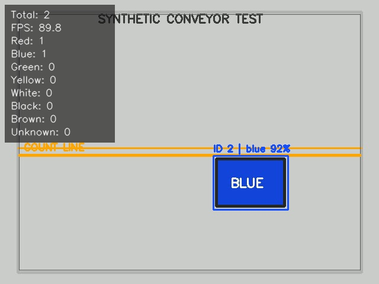

# Smart Box Counter & Color Detection System

Real-time computer vision system for automatic box detection, tracking, color classification, line-crossing counting and database logging.

**Technologies:** Browser JavaScript, Canvas Computer Vision, IndexedDB, Python, OpenCV, Object Tracking, HSV Color Classification, SQLite, YOLO26, ByteTrack.

This repository contains two complete editions of the same fixed-camera counting pipeline:

- **Browser edition:** deploys as a static site on Vercel, needs no installation, accesses the user's webcam over HTTPS, performs all vision work on-device, and stores events in IndexedDB.
- **Desktop edition:** runs locally with Python/OpenCV, stores events in SQLite, and optionally replaces classical detection with YOLO26 + ByteTrack.

## Use online — no installation

Open the deployed Vercel URL in current Chrome, Edge, or Safari, click **Start camera**, and allow camera access. Nothing is installed and video frames are not uploaded to a server: detection, tracking, HSV classification, snapshots, and storage run in the browser tab.

The browser edition includes:

- USB/built-in webcam and local video-file input
- Persistent IDs, motion gating, tracking-loss tolerance, and one-time crossing counts
- All eight color results and adjustable HSV thresholds
- Live overlay, totals, per-color tally, and processing speed
- Browser-persistent event log and optional snapshots
- CSV download and calibration controls
- Responsive desktop/mobile interface

See [Deployment guide](DEPLOYMENT.md) to publish directly from GitHub to Vercel. Vercel supplies the HTTPS origin required by browser camera permissions.

## Features

- USB webcam and video-file input
- Background-separation and rectangular-contour box detection
- Persistent centroid tracking IDs with short detection-loss tolerance
- One count per ID at a configurable virtual line
- Red, blue, green, yellow, white, black, brown, and unknown HSV classification
- Live bounding boxes, IDs, colors, totals, per-color counts, and FPS
- SQLite event log, automatic CSV export, and optional event snapshots
- Interactive ROI, line, pixel-HSV, and color-range calibration
- Optional Ultralytics YOLO26 detection with ByteTrack IDs
- Headless mode and deterministic automated tests

## Desktop edition — local Python/OpenCV

Python 3.10 or newer is recommended.

```bash
python -m venv .venv
```

Windows PowerShell:

```powershell
.venv\Scripts\Activate.ps1
python -m pip install --upgrade pip
pip install -r requirements.txt
python main.py --camera 0
```

macOS/Linux:

```bash
source .venv/bin/activate
python -m pip install --upgrade pip
pip install -r requirements.txt
python main.py --camera 0
```

Press `Q` or `Esc` to stop. On shutdown, events are retained in `data/box_counts.db` and exported to `data/box_counts.csv`.

## Connect and run a USB webcam

1. Plug in the USB webcam and wait for the operating system to recognize it.
2. Mount it so it cannot move. Point it straight at a plain, evenly lit area.
3. Start with camera index `0`:

```bash
python main.py --camera 0
```

If that opens the built-in camera instead, try `--camera 1` and then `--camera 2`. Close Zoom, Teams, OBS, or other software that may have exclusive camera access.

For the first physical test, use a single **matte red shoebox or small red cardboard box**, a plain light background, and bright diffuse lighting. Begin with an empty view for one second, then move the box steadily from the top of the preview to the bottom so its center crosses the orange line. Do not stop on the line.

## Test with a video

Generate the included synthetic two-box conveyor clip:

```bash
python scripts/generate_demo_video.py
python main.py --video data/demo.mp4
```

For unattended processing:

```bash
python main.py --video data/demo.mp4 --headless
```

Use any local MP4/AVI/MOV file by replacing the path. A fixed camera and boxes moving across the line are assumed.

## Calibration

Open the calibration UI against a webcam or video:

```bash
python main.py --camera 0 --calibrate
```

- Drag with the left mouse button to define the ROI.
- Move the `Line %` slider to place the counting line.
- Right-click a pixel to inspect its OpenCV HSV value.
- Press `1` through `7` to edit red, blue, green, yellow, white, black, or brown.
- Adjust the six HSV sliders for the selected color.
- Press `S` to save immediately, or `Q`/`Esc` to save and exit.

Settings are written back to `config.yaml`. Red wraps around the HSV hue boundary and therefore retains a second range in the YAML; the calibration sliders edit its first range.

## Configuration

All operational thresholds live in `config.yaml`:

- `camera`: index, requested resolution, and FPS
- `roi`: normalized detection area
- `counting_line`: normalized location, direction, hysteresis, and minimum crossing motion
- `detection`: MOG2, contour size, morphology, aspect, and rectangularity limits
- `tracking`: match distance, lost-frame tolerance, confirmation age, and motion requirement
- `color_detection`: HSV ranges, inner crop, and minimum pixel coverage
- `storage`: database, CSV, snapshots, and snapshot toggle
- `yolo`: optional model and inference thresholds

Normalized ROI/line settings work across camera resolutions. Tune `min_area` first if small motion is accepted or valid boxes are rejected.

## Data schema and CSV export

Every accepted crossing writes one row to the SQLite `box_events` table:

| Field | Meaning |
|---|---|
| `timestamp` | Local ISO-8601 time with UTC offset |
| `track_id` | Persistent tracker ID |
| `color` | Dominant HSV class |
| `confidence` | Combined color coverage and detection confidence |
| `camera_id` | Camera index or video stem |
| `snapshot_path` | Saved crop path, if enabled |

The database assigns every application run an internal session ID and enforces `UNIQUE(session_id, camera_id, track_id)` as a final double-count guard. Tracker IDs can safely restart on the next run. Export without running a camera:

```bash
python main.py --export-csv
```

Disable snapshots for a run with `--no-snapshots`.

## Architecture

```text
USB camera / video
        |
        v
ROI -> detector -------------------------------+
       | classical: MOG2 + contours            |
       | optional: YOLO26 + ByteTrack IDs      |
       v                                        |
persistent tracks -> HSV color voting -> line crossing
                                              |
                                              v
                              SQLite -> CSV + snapshots
                                              |
                                              v
                                         live overlay
```

The hosted browser edition uses the same stages entirely on the client:

```text
Browser webcam / uploaded video
        -> Canvas background separation
        -> connected rectangular regions
        -> persistent centroid tracks
        -> HSV color voting + line crossing
        -> IndexedDB events + snapshots -> CSV download
```

Key modules:

- `src/detector.py` — classical fixed-camera detection
- `src/tracking.py` — centroid tracker and external-ID state adapter
- `src/color.py` — robust inner-crop HSV classification
- `src/pipeline.py` — crossing state, counting, and overlay
- `src/storage.py` — SQLite, uniqueness, snapshots, and CSV
- `src/calibration.py` — interactive tuning
- `src/yolo_detector.py` — optional YOLO26/ByteTrack adapter
- `web/index.html` — no-install browser application
- `web/app.js` — browser vision, tracking, counting, storage, and export engine
- `web/styles.css` — responsive industrial control interface
- `vercel.json` — zero-build Vercel deployment configuration

## Optional YOLO26 + ByteTrack mode

Use this only when the classical detector struggles with overlap, clutter, or a changing background:

```bash
pip install -r requirements-yolo.txt
python main.py --camera 0 --detector yolo --model path/to/best.pt
```

The default optional model is `yolo26n.pt`, but a general-purpose model may not have a useful `box` class for cardboard packages. For real deployments, train an Ultralytics detection model on your box appearance and pass `best.pt`. The adapter calls Ultralytics tracking with `persist=True` and `tracker="bytetrack.yaml"`; the same HSV, crossing, database, snapshot, CSV, and overlay pipeline remains in use.

## Tests

```bash
pytest -q
```

The suite verifies all seven named colors, invalid crops, stable and unique IDs, loss tolerance, expired IDs, database duplicate protection, CSV output, one-time crossing, and rejection of stationary objects.

Runtime smoke test:

```bash
python scripts/generate_demo_video.py
python main.py --video data/demo.mp4 --headless
```

Expected result: two counted tracks (one red and one blue), an exported CSV, and two optional crop snapshots.

## Screenshots



The generated screenshot shows the live tracking overlay with an ID, color label, total count, per-color totals, and FPS.

## Browser privacy and storage

The Vercel deployment is static. Camera frames stay in the visitor's browser and are not sent to Vercel or this repository. Counts and optional snapshots are stored only in that browser's IndexedDB. Export CSV before clearing browser data or moving to another device. The Python edition remains the right choice when a shared central SQLite database or a custom YOLO model is required.

## Limitations

- The fast classical detector assumes a fixed camera and a mostly stable, well-lit background.
- Touching/overlapping boxes can merge into one contour; use the optional trained YOLO model for that case.
- HSV color depends on illumination, white balance, reflections, printed labels, and how tightly the box is cropped.
- The centroid tracker is intentionally small and motion-only; long occlusion can create a new ID.
- Counting uses each box center, so the complete box must travel across the line.
- Long-running production use will eventually need database retention/archival rules.

## Future improvements

- Operator/batch IDs and shift-level production reports
- Perspective correction and conveyor speed estimation
- Multi-line and bidirectional flow analytics
- Automatic exposure/white-balance lock and color-card calibration
- Trained YOLO26 package model with segmentation for overlapping boxes
- Web dashboard, alerts, and production health metrics
- Industrial trigger or PLC integration

## Command reference

```bash
python main.py --camera 0
python main.py --video test.mp4
python main.py --camera 0 --calibrate
python main.py --video data/demo.mp4 --headless --max-frames 120
python main.py --export-csv
python main.py --camera 0 --detector yolo --model path/to/best.pt
```
